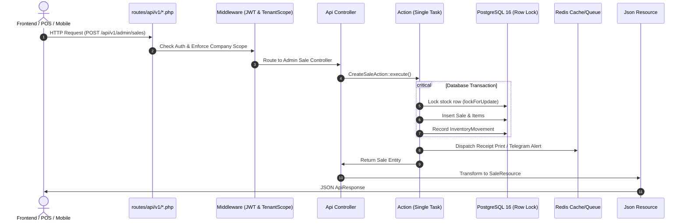

# ⚙️ Full Backend Structure & Technical Blueprint: `backend-khposcommerce/`

> **Directory Root:** [`backend-khposcommerce/`](file:///Users/macbook/Workspace/projects/systems/pos-ecommerce/backend-khposcommerce)  
> **Framework:** Laravel 12 / PHP 8.3+  
> **Database:** PostgreSQL 16  
> **Cache & Queue:** Redis 7 (Alpine)  
> **Architectural Pattern:** Domain-Driven Design (DDD), Single-Responsibility Actions Pattern, Consumer-Segregated Multi-Channel APIs & Clean Repositories.

---

## 1. រចនាសម្ព័ន្ធឯកសារពេញលេញ (Full Directory & File Tree)

```text
backend-khposcommerce/
│
├── app/
│   │
│   ├── Actions/                                # Single Responsibility Business Actions (Atomic Transactions)
│   │   ├── Auth/
│   │   │   ├── LoginAction.php
│   │   │   ├── LogoutAction.php
│   │   │   ├── RefreshTokenAction.php
│   │   │   ├── RegisterAction.php
│   │   │   └── ResetPasswordAction.php
│   │   │
│   │   ├── Company/
│   │   │   ├── CreateCompanyAction.php
│   │   │   └── UpdateCompanyAction.php
│   │   │
│   │   ├── Product/
│   │   │   ├── CreateProductAction.php
│   │   │   ├── UpdateProductAction.php
│   │   │   └── DeleteProductAction.php
│   │   │
│   │   ├── Inventory/
│   │   │   ├── AdjustStockAction.php
│   │   │   ├── TransferStockAction.php
│   │   │   └── ReceiveStockAction.php
│   │   │
│   │   ├── Purchase/
│   │   │   ├── CreatePurchaseAction.php
│   │   │   ├── UpdatePurchaseAction.php
│   │   │   ├── ReceivePurchaseAction.php
│   │   │   └── CancelPurchaseAction.php
│   │   │
│   │   ├── Sales/
│   │   │   ├── CreateSaleAction.php
│   │   │   ├── CancelSaleAction.php
│   │   │   └── RefundSaleAction.php
│   │   │
│   │   ├── POS/
│   │   │   ├── CheckoutAction.php
│   │   │   ├── OpenRegisterAction.php
│   │   │   └── CloseRegisterAction.php
│   │   │
│   │   ├── Order/
│   │   │   ├── CreateOrderAction.php
│   │   │   ├── ConfirmOrderAction.php
│   │   │   ├── CancelOrderAction.php
│   │   │   └── ReturnOrderAction.php
│   │   │
│   │   └── Payment/
│   │       ├── CreatePaymentAction.php
│   │       ├── ConfirmPaymentAction.php
│   │       └── RefundPaymentAction.php
│   │
│   ├── Console/
│   │   └── Commands/                           # Custom Artisan CLI commands
│   │
│   ├── Enums/                                  # Native PHP 8.2+ Strongly Typed Enums
│   │   ├── CurrencyCode.php
│   │   ├── OrderStatus.php
│   │   ├── PaymentStatus.php
│   │   ├── PaymentMethod.php
│   │   ├── PurchaseStatus.php
│   │   ├── SaleStatus.php
│   │   ├── InventoryStatus.php
│   │   ├── StockMovementType.php
│   │   ├── UserStatus.php
│   │   └── QuantityUnit.php
│   │
│   ├── Events/                                 # Domain Event Triggers
│   │   ├── OrderCreated.php
│   │   ├── SaleCompleted.php
│   │   ├── PaymentCompleted.php
│   │   ├── StockTransferred.php
│   │   └── NotificationCreated.php
│   │
│   ├── Exceptions/                             # Custom Business & Tenant Exceptions
│   │   ├── BusinessException.php
│   │   ├── InsufficientStockException.php
│   │   ├── InvalidPaymentException.php
│   │   ├── TenantAccessException.php
│   │   └── ...
│   │
│   ├── Http/
│   │   │
│   │   ├── Controllers/
│   │   │   └── Api/
│   │   │       └── V1/
│   │   │           │
│   │   │           ├── Public/                 # Public Unauthenticated Endpoints
│   │   │           │   ├── HealthController.php
│   │   │           │   ├── ConfigController.php
│   │   │           │   └── SeoController.php
│   │   │           │
│   │   │           ├── Auth/                   # Central User Auth & Identity
│   │   │           │   ├── AuthController.php
│   │   │           │   ├── ProfileController.php
│   │   │           │   ├── DeviceController.php
│   │   │           │   ├── SecurityController.php
│   │   │           │   ├── RoleController.php
│   │   │           │   └── PermissionController.php
│   │   │           │
│   │   │           ├── Admin/                  # Back-Office ERP & POS Administration
│   │   │           │   ├── Company/
│   │   │           │   │   ├── CompanyController.php
│   │   │           │   │   ├── BranchController.php
│   │   │           │   │   ├── WarehouseController.php
│   │   │           │   │   └── StoreController.php
│   │   │           │   │
│   │   │           │   ├── Product/
│   │   │           │   │   ├── ProductController.php
│   │   │           │   │   ├── CategoryController.php
│   │   │           │   │   ├── BrandController.php
│   │   │           │   │   ├── VariantController.php
│   │   │           │   │   ├── AttributeController.php
│   │   │           │   │   ├── UnitController.php
│   │   │           │   │   └── TaxController.php
│   │   │           │   │
│   │   │           │   ├── Inventory/
│   │   │           │   │   ├── InventoryController.php
│   │   │           │   │   ├── StockAdjustmentController.php
│   │   │           │   │   ├── StockTransferController.php
│   │   │           │   │   ├── StockOpnameController.php
│   │   │           │   │   └── StockMovementController.php
│   │   │           │   │
│   │   │           │   ├── Purchase/
│   │   │           │   │   ├── PurchaseController.php
│   │   │           │   │   ├── PurchaseReturnController.php
│   │   │           │   │   └── PurchaseReceiveController.php
│   │   │           │   │
│   │   │           │   ├── Supplier/
│   │   │           │   │   ├── SupplierController.php
│   │   │           │   │   └── SupplierContactController.php
│   │   │           │   │
│   │   │           │   ├── Sales/
│   │   │           │   │   ├── SaleController.php
│   │   │           │   │   ├── SaleReturnController.php
│   │   │           │   │   └── InvoiceController.php
│   │   │           │   │
│   │   │           │   ├── POS/
│   │   │           │   │   ├── POSController.php
│   │   │           │   │   ├── CashRegisterController.php
│   │   │           │   │   └── POSSessionController.php
│   │   │           │   │
│   │   │           │   ├── Order/
│   │   │           │   │   ├── OrderController.php
│   │   │           │   │   ├── OrderReturnController.php
│   │   │           │   │   └── ShipmentController.php
│   │   │           │   │
│   │   │           │   ├── Payment/
│   │   │           │   │   ├── PaymentController.php
│   │   │           │   │   └── PaymentMethodController.php
│   │   │           │   │
│   │   │           │   ├── Customer/
│   │   │           │   │   ├── CustomerController.php
│   │   │           │   │   ├── CustomerAddressController.php
│   │   │           │   │   └── CustomerGroupController.php
│   │   │           │   │
│   │   │           │   ├── Employee/
│   │   │           │   │   ├── EmployeeController.php
│   │   │           │   │   ├── AttendanceController.php
│   │   │           │   │   ├── ShiftController.php
│   │   │           │   │   ├── LeaveController.php
│   │   │           │   │   └── PayrollController.php
│   │   │           │   │
│   │   │           │   ├── Expense/
│   │   │           │   │   ├── ExpenseController.php
│   │   │           │   │   └── ExpenseCategoryController.php
│   │   │           │   │
│   │   │           │   ├── Marketing/
│   │   │           │   │   ├── PromotionController.php
│   │   │           │   │   ├── CouponController.php
│   │   │           │   │   ├── CampaignController.php
│   │   │           │   │   └── FlashSaleController.php
│   │   │           │   │
│   │   │           │   ├── Reports/
│   │   │           │   │   ├── DashboardController.php
│   │   │           │   │   ├── SalesReportController.php
│   │   │           │   │   ├── InventoryReportController.php
│   │   │           │   │   ├── PurchaseReportController.php
│   │   │           │   │   └── FinancialReportController.php
│   │   │           │   │
│   │   │           │   ├── Settings/
│   │   │           │   │   ├── SettingController.php
│   │   │           │   │   ├── CurrencyController.php
│   │   │           │   │   └── LanguageController.php
│   │   │           │   │
│   │   │           │   └── System/
│   │   │           │       ├── ActivityLogController.php
│   │   │           │       ├── AuditLogController.php
│   │   │           │       └── LoginHistoryController.php
│   │   │           │
│   │   │           ├── Customer/               # E-Commerce Web Storefront Consumers
│   │   │           │   ├── AuthController.php
│   │   │           │   ├── HomeController.php
│   │   │           │   ├── CatalogController.php
│   │   │           │   ├── SearchController.php
│   │   │           │   ├── CartController.php
│   │   │           │   ├── CheckoutController.php
│   │   │           │   ├── OrderController.php
│   │   │           │   ├── WishlistController.php
│   │   │           │   └── ReviewController.php
│   │   │           │
│   │   │           ├── Mobile/                 # Flutter Mobile POS & Staff Terminal Consumers
│   │   │           │   ├── AuthController.php
│   │   │           │   ├── DashboardController.php
│   │   │           │   ├── POSController.php
│   │   │           │   ├── ProductController.php
│   │   │           │   ├── OrderController.php
│   │   │           │   └── SyncController.php
│   │   │           │
│   │   │           └── Platform/               # SuperAdmin SaaS Management Consumers
│   │   │               ├── DashboardController.php
│   │   │               ├── TenantController.php
│   │   │               ├── CompanyController.php
│   │   │               ├── PlanController.php
│   │   │               ├── SubscriptionController.php
│   │   │               ├── BillingController.php
│   │   │               ├── UserController.php
│   │   │               ├── FeatureFlagController.php
│   │   │               └── SystemController.php
│   │   │
│   │   ├── Middleware/
│   │   │   ├── AuthenticateApi.php
│   │   │   ├── EnforceTenantScope.php
│   │   │   ├── EnsureCompanyAccess.php
│   │   │   ├── EnsureBranchAccess.php
│   │   │   ├── LocalizationMiddleware.php
│   │   │   └── ...
│   │   │
│   │   ├── Requests/                           # Strongly typed Form Request Validation
│   │   │   ├── Auth/
│   │   │   ├── Company/
│   │   │   ├── Product/
│   │   │   ├── Inventory/
│   │   │   ├── Purchase/
│   │   │   ├── Sales/
│   │   │   ├── POS/
│   │   │   ├── Order/
│   │   │   ├── Payment/
│   │   │   ├── Customer/
│   │   │   ├── Employee/
│   │   │   └── ...
│   │   │
│   │   └── Resources/                          # JSON API Transformation Layer
│   │       ├── Company/
│   │       ├── Product/
│   │       ├── Inventory/
│   │       ├── Purchase/
│   │       ├── Sales/
│   │       ├── Order/
│   │       ├── Payment/
│   │       ├── Customer/
│   │       └── User/
│   │
│   ├── Jobs/
│   │   ├── Notifications/
│   │   ├── Reports/
│   │   ├── Exports/
│   │   └── Integrations/
│   │
│   ├── Listeners/
│   │   ├── Order/
│   │   ├── Payment/
│   │   ├── Sale/
│   │   └── Notification/
│   │
│   ├── Mail/                                   # Mailable Classes
│   │
│   ├── Models/                                 # Eloquent Domain Models (Multi-Tenancy Protected)
│   │   ├── Company/
│   │   │   ├── Company.php
│   │   │   ├── Branch.php
│   │   │   ├── Store.php
│   │   │   ├── Warehouse.php
│   │   │   ├── Plan.php
│   │   │   └── Subscription.php
│   │   │
│   │   ├── Product/
│   │   │   ├── Product.php
│   │   │   ├── ProductVariant.php
│   │   │   ├── Category.php
│   │   │   ├── Brand.php
│   │   │   ├── Attribute.php
│   │   │   ├── AttributeValue.php
│   │   │   ├── Unit.php
│   │   │   └── Tax.php
│   │   │
│   │   ├── Inventory/
│   │   │   ├── Inventory.php
│   │   │   ├── InventoryMovement.php
│   │   │   ├── StockAdjustment.php
│   │   │   ├── StockTransfer.php
│   │   │   └── StockOpname.php
│   │   │
│   │   ├── Purchase/
│   │   │   ├── Purchase.php
│   │   │   ├── PurchaseItem.php
│   │   │   ├── PurchaseReturn.php
│   │   │   └── PurchaseReturnItem.php
│   │   │
│   │   ├── Sales/
│   │   │   ├── Sale.php
│   │   │   ├── SaleItem.php
│   │   │   ├── SaleReturn.php
│   │   │   └── SaleReturnItem.php
│   │   │
│   │   ├── POS/
│   │   │   ├── CashRegister.php
│   │   │   ├── CashRegisterSession.php
│   │   │   └── CashRegisterTransaction.php
│   │   │
│   │   ├── Order/
│   │   │   ├── Order.php
│   │   │   ├── OrderItem.php
│   │   │   ├── Cart.php
│   │   │   ├── CartItem.php
│   │   │   ├── Wishlist.php
│   │   │   ├── Shipment.php
│   │   │   ├── OrderReturn.php
│   │   │   └── ReturnPolicy.php
│   │   │
│   │   ├── Payment/
│   │   │   ├── Payment.php
│   │   │   ├── PaymentMethod.php
│   │   │   └── Transaction.php
│   │   │
│   │   ├── Customer/
│   │   │   ├── Customer.php
│   │   │   ├── CustomerAddress.php
│   │   │   ├── CustomerGroup.php
│   │   │   ├── CustomerWallet.php
│   │   │   └── CustomerPointLedger.php
│   │   │
│   │   ├── Employee/
│   │   │   ├── Employee.php
│   │   │   ├── Department.php
│   │   │   ├── Position.php
│   │   │   ├── Attendance.php
│   │   │   ├── Shift.php
│   │   │   ├── LeaveRequest.php
│   │   │   └── Payroll.php
│   │   │
│   │   ├── Marketing/
│   │   ├── Expense/
│   │   ├── Shipping/
│   │   ├── CMS/
│   │   ├── Notification/
│   │   ├── Audit/
│   │   └── User.php
│   │
│   ├── Notifications/
│   │
│   ├── Policies/                               # Granular Authorization Policies
│   │   ├── CompanyPolicy.php
│   │   ├── BranchPolicy.php
│   │   ├── ProductPolicy.php
│   │   ├── InventoryPolicy.php
│   │   ├── PurchasePolicy.php
│   │   ├── SalePolicy.php
│   │   ├── OrderPolicy.php
│   │   ├── PaymentPolicy.php
│   │   ├── CustomerPolicy.php
│   │   └── UserPolicy.php
│   │
│   ├── Repositories/                           # Repository Layer (Contract + Implementation)
│   │   ├── Contracts/
│   │   │   ├── ProductRepositoryInterface.php
│   │   │   ├── InventoryRepositoryInterface.php
│   │   │   ├── PurchaseRepositoryInterface.php
│   │   │   ├── SaleRepositoryInterface.php
│   │   │   ├── OrderRepositoryInterface.php
│   │   │   ├── PaymentRepositoryInterface.php
│   │   │   └── CustomerRepositoryInterface.php
│   │   │
│   │   └── Eloquent/
│   │       ├── ProductRepository.php
│   │       ├── InventoryRepository.php
│   │       ├── PurchaseRepository.php
│   │       ├── SaleRepository.php
│   │       ├── OrderRepository.php
│   │       ├── PaymentRepository.php
│   │       └── CustomerRepository.php
│   │
│   ├── Services/                               # Orchestration & Complex Business Logic
│   │   ├── Auth/
│   │   │   ├── AuthService.php
│   │   │   ├── TokenService.php
│   │   │   └── ProfileService.php
│   │   │
│   │   ├── Product/
│   │   │   ├── ProductService.php
│   │   │   ├── PricingService.php
│   │   │   └── TaxService.php
│   │   │
│   │   ├── Inventory/
│   │   │   ├── InventoryService.php
│   │   │   ├── StockService.php
│   │   │   └── StockTransferService.php
│   │   │
│   │   ├── Purchase/
│   │   │   └── PurchaseService.php
│   │   │
│   │   ├── Sales/
│   │   │   ├── SaleService.php
│   │   │   └── SalePricingService.php
│   │   │
│   │   ├── POS/
│   │   │   ├── POSService.php
│   │   │   └── CashRegisterService.php
│   │   │
│   │   ├── Order/
│   │   │   ├── OrderService.php
│   │   │   ├── CartService.php
│   │   │   └── CheckoutService.php
│   │   │
│   │   ├── Payment/
│   │   │   └── PaymentService.php
│   │   │
│   │   ├── Customer/
│   │   │   └── CustomerService.php
│   │   │
│   │   ├── Reports/
│   │   │   ├── DashboardService.php
│   │   │   ├── SalesReportService.php
│   │   │   └── InventoryReportService.php
│   │   │
│   │   ├── Tenant/
│   │   │   ├── TenantContext.php
│   │   │   └── AccessScopeService.php
│   │   │
│   │   └── Integrations/                       # Third-Party External Gateways & APIs
│   │       ├── Telegram/
│   │       ├── KHQR/
│   │       ├── ABA/
│   │       └── Stripe/
│   │
│   ├── Support/                                # Cross-cutting Utilities & Helpers
│   │   ├── Api/
│   │   │   ├── ApiResponse.php
│   │   │   └── PaginationResponse.php
│   │   │
│   │   ├── Filters/
│   │   │   └── QueryFilter.php
│   │   │
│   │   ├── Helpers/
│   │   ├── Pagination/
│   │   └── Tenant/
│   │
│   └── Traits/                                 # Domain Traits
│       ├── BelongsToCompany.php
│       ├── BelongsToBranch.php
│       ├── Filterable.php
│       ├── HasMedia.php
│       └── HasReferenceNumber.php
│
├── bootstrap/
│   ├── app.php
│   └── providers.php
│
├── config/                                     # System Configurations
│   ├── app.php
│   ├── auth.php
│   ├── cache.php
│   ├── database.php
│   ├── filesystems.php
│   ├── logging.php
│   ├── mail.php
│   ├── permission.php
│   ├── queue.php
│   ├── services.php
│   ├── session.php
│   └── ...
│
├── database/
│   ├── factories/
│   │   ├── UserFactory.php
│   │   ├── ProductFactory.php
│   │   └── ...
│   │
│   ├── migrations/                             # Versioned Schema Migrations
│   │   ├── 0001_create_users_table.php
│   │   ├── ...
│   │   └── enterprise domain migrations
│   │
│   └── seeders/                                # Database Seeders & Demo Catalogs
│       ├── DatabaseSeeder.php
│       ├── RolesPermissionsSeeder.php
│       ├── CompanySeeder.php
│       ├── ProductSeeder.php
│       ├── CustomerSeeder.php
│       └── ...
│
├── lang/
│   ├── en/                                     # English localization
│   └── km/                                     # Khmer localization (ភាសាខ្មែរ)
│
├── routes/
│   ├── api.php                                 # Master API route registrar
│   ├── api/
│   │   └── v1/
│   │       ├── public.php                      # /api/v1/public/*
│   │       ├── auth.php                        # /api/v1/auth/*
│   │       ├── admin.php                       # /api/v1/admin/*
│   │       ├── customer.php                    # /api/v1/customer/*
│   │       ├── mobile.php                      # /api/v1/mobile/*
│   │       └── platform.php                    # /api/v1/platform/*
│   │
│   ├── console.php
│   └── web.php
│
├── storage/
│
├── tests/
│   ├── Feature/                                # Integration & Flow Tests
│   │   ├── Auth/
│   │   ├── Product/
│   │   ├── Inventory/
│   │   ├── Purchase/
│   │   ├── Sales/
│   │   ├── POS/
│   │   ├── Orders/
│   │   ├── Payments/
│   │   └── Tenant/
│   │
│   ├── Unit/                                   # Isolated Unit Tests
│   │   ├── Services/
│   │   ├── Actions/
│   │   └── Repositories/
│   │
│   └── Architecture/                           # Architectural Consistency Tests
│
├── docker/
│   ├── php/
│   │   ├── Dockerfile
│   │   └── php.ini
│   └── nginx/
│       └── default.conf
│
├── .env.example
├── .gitignore
├── artisan
├── composer.json
├── Dockerfile
├── phpunit.xml
└── README.md
```

---

## 2. គោលការណ៍ស្ថាបត្យកម្មស្នូល (Core Architecture Principles)

### ២.១ Actions vs Services
* **Actions (`app/Actions/*`):** ទទួលបន្ទុកប្រតិបត្តិការកែប្រែទិន្នន័យ (State Mutations) ដែលមានកិច្ចការតែមួយគត់ (Single Responsibility) និងត្រូវបានរុំដោយ `DB::transaction()` ដោយស្វ័យប្រវត្តិ។ Actions អាចត្រូវបានហៅប្រើប្រាស់ដោយ Controllers, Queue Workers, ឬ Console Commands។
* **Services (`app/Services/*`):** ទទួលបន្ទុក Business Orchestration ធំៗ, ការគណនាតម្លៃ, ការទាញទិន្នន័យពីច្រើន Domain, និងការគ្រប់គ្រង Integrations ជាមួយភាគីទីបី (Bakong KHQR, ABA PayWay, Stripe, Telegram)។

### ២.២ ការបែងចែក Consumer API ដាច់ដោយឡែក
1. `/api/v1/admin/*`: ផ្ដល់ជូន Back-office ERP, POS Cashier Terminal, Inventory, HR & Accounting។
2. `/api/v1/customer/*`: ផ្ដល់ជូន Web Storefront E-Commerce (Cart, Wishlist, Store Catalog, Self-Checkout)។
3. `/api/v1/mobile/*`: ផ្ដល់ជូន Flutter Mobile App សម្រាប់បុគ្គលិកលក់ និងការធ្វើ Sync ទិន្នន័យ Off-line។
4. `/api/v1/platform/*`: ផ្ដល់ជូន SuperAdmin SaaS សម្រាប់គ្រប់គ្រង Tenants, Subscriptions, និង Payment Gateway Master Keys។
5. `/api/v1/auth/*`: គ្រប់គ្រង JWT Authentication, Password Recovery, Profiles, និង Spatie RBAC Permissions។
6. `/api/v1/public/*`: ផ្ដល់ជូន System Health Checks, Brand Logos, និង Media Streamers។

### ២.៣ សុវត្ថិភាពទិន្នន័យពហុម្ចាស់កម្មសិទ្ធិ (Multi-Tenancy Isolation)
* រាល់ Model ទាំងអស់ដែលជាទិន្នន័យរបស់ Tenant ត្រូវតែប្រើ `BelongsToCompany` និងជាជម្រើស `BelongsToBranch` trait។
* គ្រប់ Query ទាំងអស់ត្រូវឆ្លងកាត់ `EnforceTenantScope` middleware ដើម្បីទប់ស្កាត់ការមើលឃើញទិន្នន័យឆ្លងកាត់ Company ផ្សេងគ្នា។

---

## 3. ដ្យាក្រាមដំណើរការទិន្នន័យ (Request Lifecycle)


