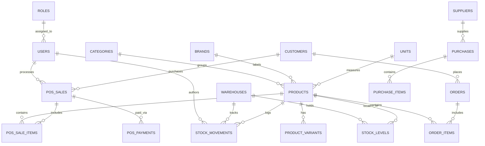

# 🗄️ Database Architecture & Schema Overview

## 1. Overview & Engine Specification

The database is built on **MySQL 8.0** with strict **InnoDB** engine settings to guarantee ACID transactions, foreign key integrity, row-level concurrency locking, and UTF8mb4 character set support (handling Khmer Unicode, Chinese characters, Thai, Vietnamese accents, and emojis).

---

## 2. Core Entity Relationship Diagram (ERD)

---

## 3. Database Design Highlights

1. **Strict Financial & Stock Auditing**:
   - Stock counts are backed by `inventory_movements` (an immutable event ledger). Every single inventory increase, decrease, sale, or adjustment has an associated audit movement record with user attribution and timestamp.
2. **High-Performance Composite Indices (100k - 1M+ Records)**:
   - Composite indices across 8 core domains (`sales`, `orders`, `inventory_movements`, `products`, `customers`, `purchases`, `expenses`, `audit_logs`) ensure sub-millisecond lookups even with 1,000,000+ records.
   - For detailed table matrix and query patterns, see: [Database Performance & Indexing Guide](file:///Users/macbook/Workspace/projects/showcase/khposcommerce/docs/database/database-performance-and-indexing.md).
3. **Soft Deletes**:
   - Critical catalog items (`products`, `categories`, `orders`, `users`, `sales`) utilize `deleted_at` timestamps for data recovery and compliance, with index support.
